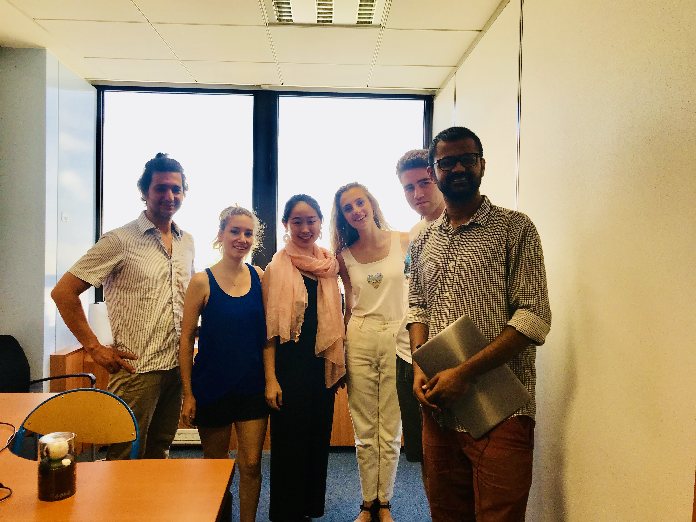

---

layout: post
---

## Sexual Harassment &gt;&gt;&gt; Changing the perception

Women experience a myriad of emotions when sexually harassed - pain, anger, vulnerability, confusion, helplessness, violation, depression to name a few. These are powerful expressions that the society often overlooks so we are building a medium to give them shape and fight sexual harassment.

By bridging the gap between an act of violation and the underlying emotions, we are creating a systemic behavioural change towards sexual harassment through empathy.

Combining VR technology, 360-degree video, CGI animation and motion capture to create experiences where players step into the body of women as they go through sexual harassment.

---

### Our origins

Team V started out as a group of five international students from China, Canada, India, Turkey
and Scotland who met at the CRI Labs 2018 summer school in Paris. We developed BehindHerEyes as
a Virtual Reality experience to promote gender equality in collaboration with CRI and BeAnotherLab;
in BehindHerEyes, users accompany a young woman as she goes through an evening of her life and
are given options to react to different events as she witnesses sexual harassment in the street,
then experiences it herself in a bar. The project was presented at the end of the summer school
in Les Grands Voisins in Paris. [More info about the Paris project on this page](bhe/index.html).

---

### See for She in China

See for She is a Virtual Reality experience specifically designed for a Chinese audience to tackle
gender equality issues in the workplace. The project was first presented at the November 2018 Gender
& CSR conference in Chengdu supported by UN Women, and received positive feedback from both the chinese
and international audience. Based on this feedback, we are now able to move forward and focus on
creating an entirely new and innovative experience.

---

### Pictures

<figure class="half">
	
	
</figure>
<figure class="half">
	
</figure>

---

### What people say

#### Philippe Bertrand
Instigator of BeAnotherLab
> Behind Her Eyes explores the potential use of immersive videos in VR to help society to overcome the culture of gender violence. Beta-tests in Paris have shown an interesting emotional impact in males, what may be significant to expand individual's consciousness and change negative social behaviors. The prototype points out to a promising continuation of this research on how to use different perceptive illusions in VR to enhance men's empathic abilities regarding sexual harassment.

#### Daniel Assayag
Actor of BehindHerEyes
> This experience make you feel the inacceptable presence of one that steps upon your intimate space. Virtual universe, offer the possibility for the viewer to live that moment without the terrible consequences. This VR interactive show is a direct uppercut, that wires your brain to the understanding of what women are put through everyday in our over-sexualised societies.

#### Jessica Talley Sagot
Center for research and Interdisciplinary | M2 AIV/EdTech
> A VR experience that captures a universal yet personal journey on the provocative subject of violence against women. I found myself asking questions I hadn't considered, which balanced discussion of what makes a singular experience so devastatingly uncomfortable for women.

---

#### -Team V-

With support from:

